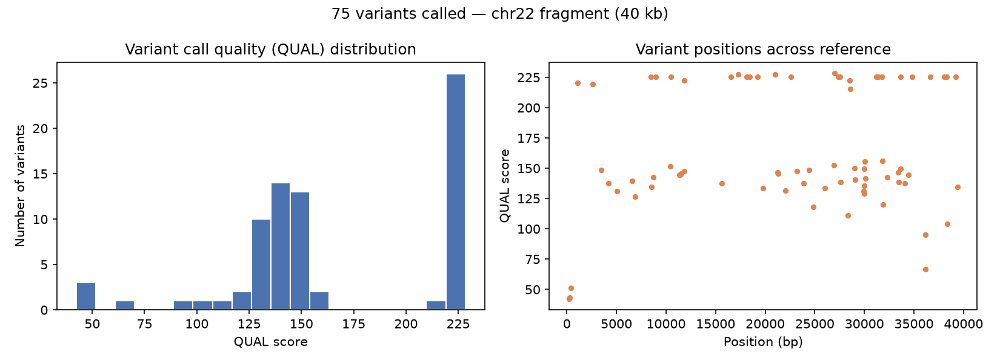

# 🧬 Variant Calling Pipeline


A small, complete NGS variant-calling pipeline: raw reads → QC → trimming → alignment → variant calls → summary plot.

Runs on a 40 kb reference fragment (chr22) with simulated paired-end reads, so it finishes in under a minute and every call can be checked against a known ground truth.

## Pipeline

| Step | Tool |
|---|---|
| Simulate reads with known variants | wgsim |
| Quality control | FastQC |
| Trimming | fastp |
| Alignment | BWA-MEM + samtools |
| Variant calling | bcftools |
| Summary plot | matplotlib |

## Results (this run)

- 20,000 simulated read pairs, 100% mapped, 100% properly paired
- 75 true variants introduced → 75 called after QUAL≥20 filtering → **75/75 correctly recovered, 0 false positives**



## Running it

Requires `bwa`, `samtools`, `bcftools`, `fastqc`, `fastp` (all installed via `apt` on Ubuntu/WSL), plus Python with `matplotlib`.

```bash
# 1. Get reference + simulate reads
curl -sL "https://raw.githubusercontent.com/nf-core/test-datasets/modules/data/genomics/homo_sapiens/genome/genome.fasta" -o data/reference/genome.fasta
wgsim -N 20000 -1 100 -2 100 -r 0.002 -R 0.001 -e 0.005 data/reference/genome.fasta data/reads/sample_R1.fastq data/reads/sample_R2.fastq > data/reference/wgsim_truth.txt
gzip data/reads/*.fastq

# 2. QC + trim
fastqc data/reads/*.fastq.gz -o results/
fastp -i data/reads/sample_R1.fastq.gz -I data/reads/sample_R2.fastq.gz -o results/sample_R1.trimmed.fastq.gz -O results/sample_R2.trimmed.fastq.gz -j results/fastp.json -h results/fastp.html

# 3. Align
bwa index data/reference/genome.fasta
samtools faidx data/reference/genome.fasta
bwa mem -R "@RG\tID:sample1\tSM:sample1\tPL:ILLUMINA" data/reference/genome.fasta results/sample_R1.trimmed.fastq.gz results/sample_R2.trimmed.fastq.gz | samtools sort -o results/sample.sorted.bam -
samtools index results/sample.sorted.bam

# 4. Call variants
bcftools mpileup -f data/reference/genome.fasta results/sample.sorted.bam | bcftools call -mv -Oz -o results/sample.raw.vcf.gz
bcftools index -t results/sample.raw.vcf.gz
bcftools view -i 'QUAL>=20' results/sample.raw.vcf.gz -Oz -o results/sample.filtered.vcf.gz
bcftools index -t results/sample.filtered.vcf.gz

# 5. Summary plot
python3 scripts/05_summary_plot.py
```

## Notes

Built and run on WSL2 Ubuntu. Simulated reads (rather than real sequencing data) were used deliberately, so results could be validated against a known ground truth — a standard practice before trusting a pipeline on real data.

## Next steps

- Swap in real sequencing data (e.g. a small bacterial genome + real reads from SRA/ENA)
- Add variant annotation (e.g. SnpEff) to see which calls fall in coding regions
